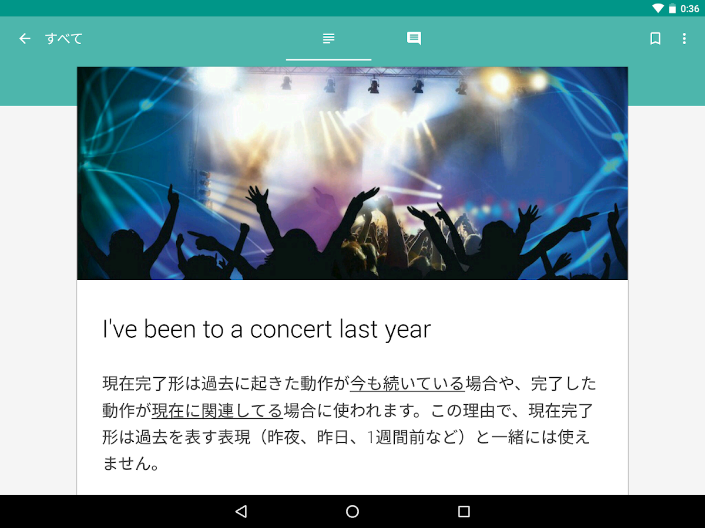

# Hello Eigo

A client app for a blog that was served by a Rails backend. Currently unpublished from the Play Store.  
 
## Libraries 
 
- RxJava
- Retrofit
- Dagger

## Screenshots

    

    

    

    

